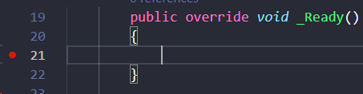

# godot_debugging_issue

This repo has been created to illustrate a bug. See the [related issue](https://github.com/godotengine/godot-csharp-vscode/issues/17).

# Instructions

1. `git clone` somewhere.
2. Open the folder in godot editor.
3. Add the default `godot C#` debugging configuration.
4. In `new_script.cs`, set a breakpoint in `_Ready()`.

5. Hit play in editor in the debug window.
6. Add `Test.TestClass.TestVar` to watched variables.
7. Observe the error.
